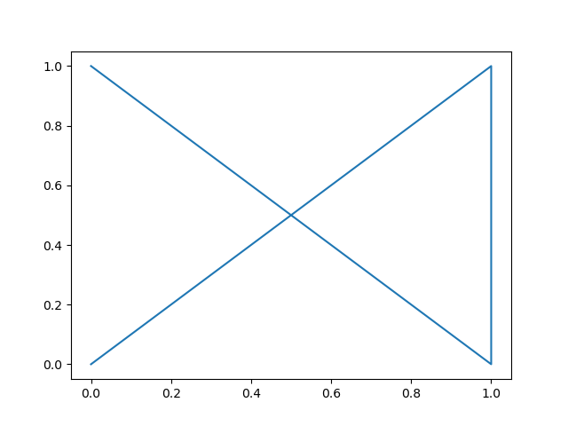

# TPs MPI

## Exercice 1 : Warm up

1. Running the code in Lab directory 
**result of the test_graphic python file**
```shell       
python3 test_graphic.py
```


**result of runnig test_mpi.py**
```shell
mpirun -n 2 python3 test_mpi.py
    rank : 0 , size : 2
    rank : 1 , size : 2
```

2. Running the code in Lecture directory

**Running the file _bcast.py_**
```shell
mpirun -n 4 python3 bcast.py
A on  0 = [0. 1. 2. 3. 4. 5. 6. 7. 8. 9.]
A on  1 = [0. 1. 2. 3. 4. 5. 6. 7. 8. 9.]
A on  2 = [0. 1. 2. 3. 4. 5. 6. 7. 8. 9.]
A on  3 = [0. 1. 2. 3. 4. 5. 6. 7. 8. 9.]
```

after we initiate the Array A wiith the value 1,2,3...,10 in the first process we are going and with zeros in the otehr processes, we are going to broadcast the A from rhe first process with the rank 0, to all the other ones using the code:
```python 
comm.Bcast(A, root=0)
```

**Running the  file _gather.py_**
```shell
mpirun -n 4 python3 gather.py
    local_rank on  0 = [0]
    local_rank on  1 = [1]
    A After Gather on  1 = [ 1262746869 -2117160148   -67747944       32764]
    local_rank on  3 = [3]
    A After Gather on  3 = [ 1262746869 -2117160148  1399930776       32764]
    local_rank on  2 = [2]
    A After Gather on  2 = [ 1262746869 -2117160148   190726040       32764]
    A After AllGather on  2 = [0 1 2 3]
    A After AllGather on  1 = [0 1 2 3]
    A After AllGather on  3 = [0 1 2 3]
    A After Gather on  0 = [0 1 2 3]
    A After AllGather on  0 = [0 1 2 3]
```
in this file the we are making sending the value of the rank of each process to an array A of the same size of the number of process after a simple gather we are getting the new value of ``` A = [0,1,2,3] ``` into the ```root=0``` with mean that for the process with rank 0 we are getting the new value of A and for the rest the old version witch is the array A made by _np.empty_.

But After doing an **Allgather** we get the new A into each one of the processes. 
sending the rank is made by making an array of one element being the rank it self ```[rank]```.

**Running the file _scatter.py_**
```shell        
mpirun -n 3 python3 scatter.py
    local_A on  0 = [0. 1. 2.]
    local_A on  2 = [6. 7. 8.]
    local_A on  1 = [3. 4. 5.]
```
in this exemple we had deviding the A array into the three process by passign 3 element to the correcponding rank.

**Running the file _reduce.py_**
```shell
mpirun -n 4 python3 reduce.py
    Reduced on 1 : rank= 3 somme= -1
    Reduced on 1 : rank= 0 somme= -1
    Allreduce on  0 maximum= 3
    Reduced on 1 : rank= 1 somme= 6
    Allreduce on  1 maximum= 3
    Reduced on 1 : rank= 2 somme= -1
    Allreduce on  2 maximum= 3
    Allreduce on  3 maximum= 3
```
In this part we are going to calculate the sum of ranks and put it in the array of one element sum for the process with rank 1. Then ge the max element if=n the array rank with mean the rank of the last process and put it in maxi, we use in the max exemple the _Allreduce_ witch is goign to put the result in all processes.

